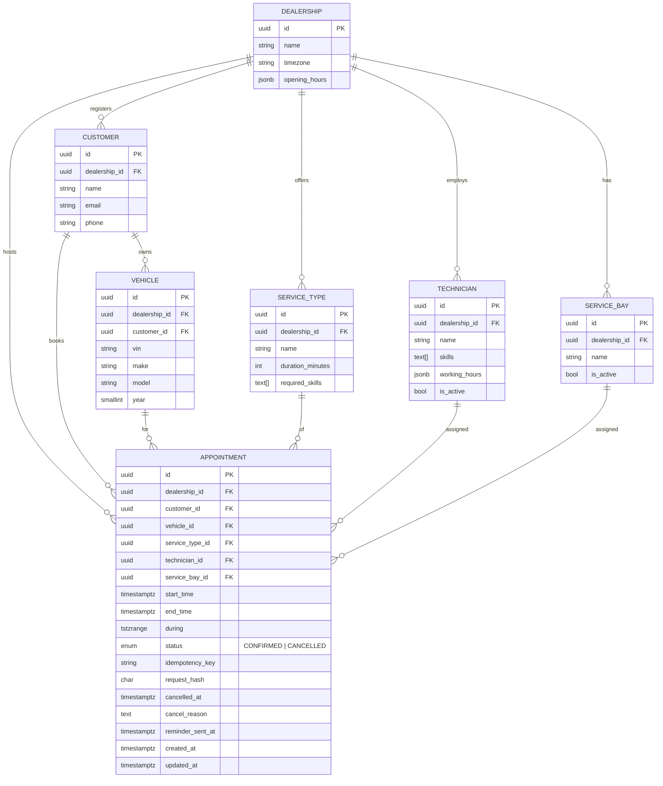
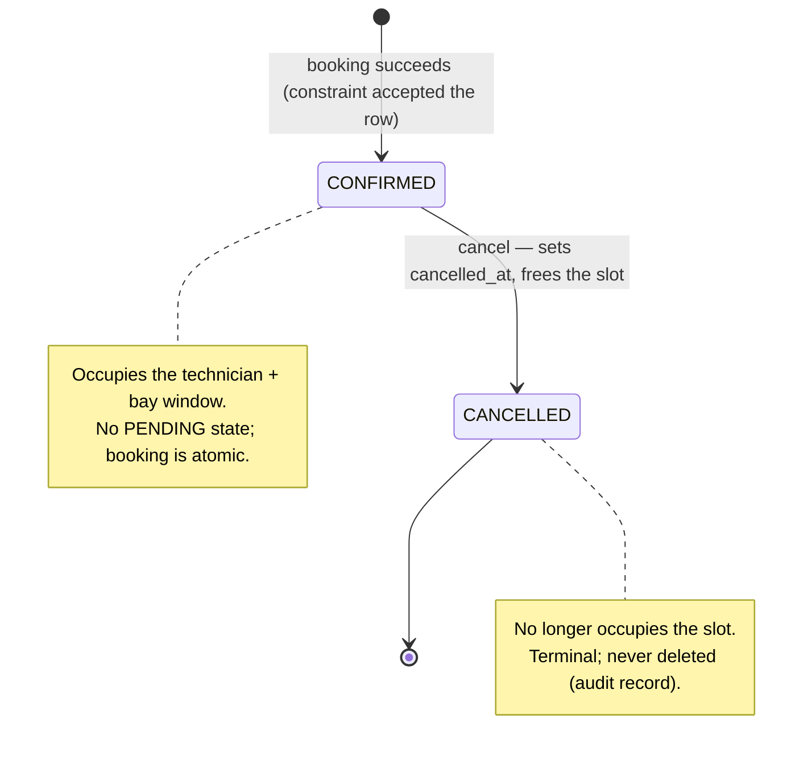
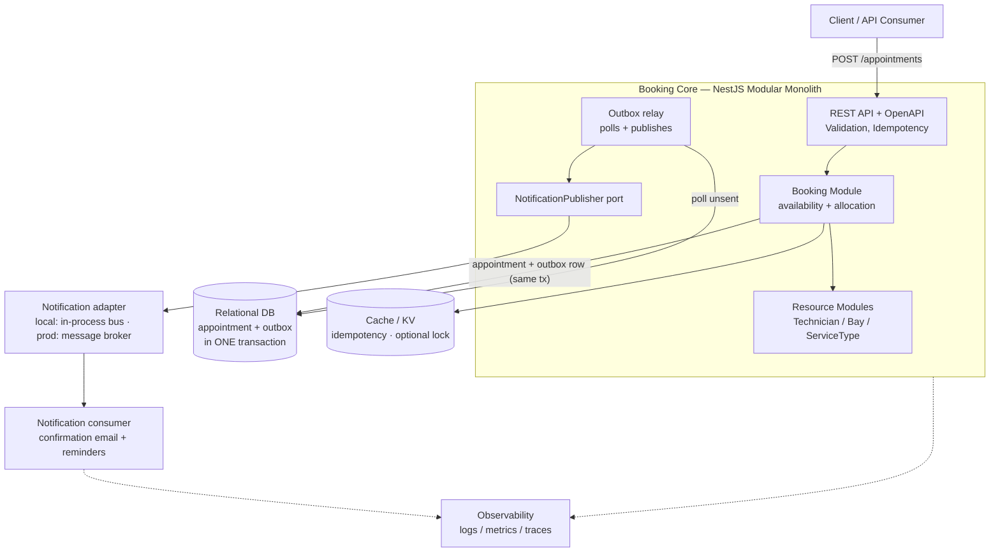
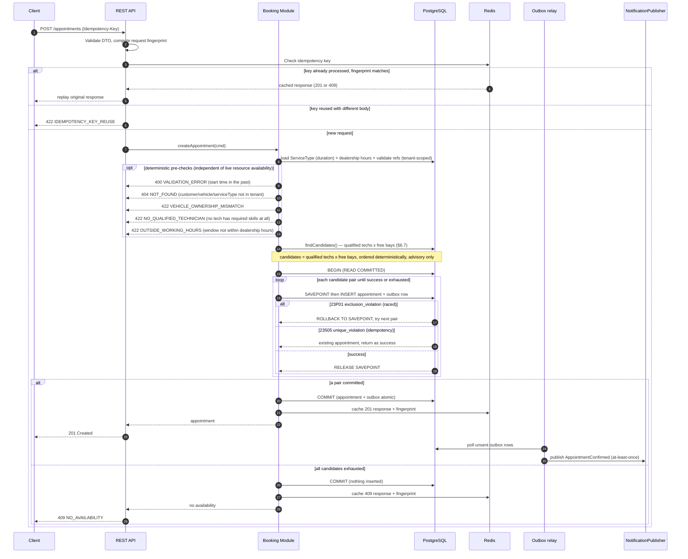
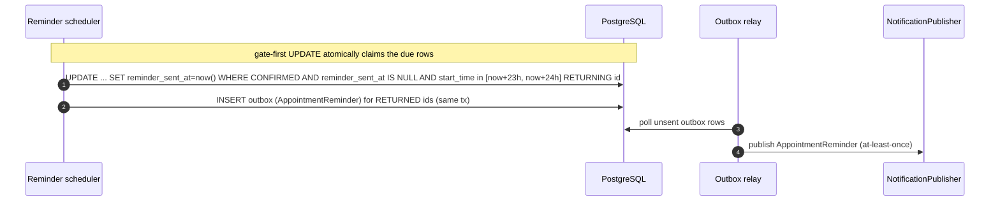
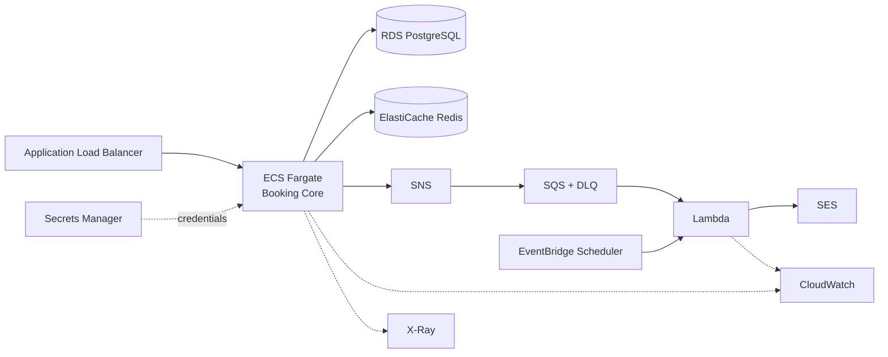

# System Design Document — Unified Service Scheduler

**Technical Assessment · Scenario A (Domain: Ownership)**
Author: Dang Phuc Toan · Version: 1.0

---

## Contents

1. Overview — Goals · Non-Goals · Functional Requirements · Non-Functional Requirements · Load Profile & Capacity · Actors
2. Assumptions
3. Domain Model — Appointment lifecycle (state machine)
4. Architecture (logical)
5. Data Flow — Booking · Cancelling · Reminder dispatch
6. Concurrency & Double-Booking Prevention *(core)* — exclusion constraint · allocation loop · idempotency · optional lock · proving it · transactional outbox · availability evaluation
7. API Design — Error catalog
8. Data Model & Schema Notes
9. Technology Choices & Justifications
10. Reliability, Performance & Scalability — Failure-mode matrix
11. Target Production Architecture (AWS) — Production↔Local mapping · HA & DR · Delivery (CI/CD)
12. Testing Strategy
13. Observability Strategy
14. Security & Multi-tenancy
15. Scaling Path
16. How GenAI Assisted the Design
17. Architecture Decision Records
18. Risks & Open Questions

> Companion documents: `database-design.md` (full schema), `infrastructure.drawio` / `infrastructure-local.drawio` (production & local topology), `docs/adr/` (full ADRs).

---

## 1. Overview

The Unified Service Scheduler replaces a dealership's manual service-booking process with an API-driven system. A customer requests a service appointment for a specific vehicle, service type, dealership, and desired time. The system verifies — in real time and under concurrent load — that **both a qualified technician and a service bay are free for the entire service duration**, then persists a confirmed `Appointment` linking customer, vehicle, technician, and bay.

The central engineering challenge is **not** CRUD; it is **guaranteeing that a resource (technician or bay) is never double-booked**, even when many booking requests arrive simultaneously. This document treats that as a first-class concern and designs around it.

### 1.1 Goals

- Accept a booking request and either confirm it against real availability or reject it with a clear reason.
- Guarantee **no double-booking** of any technician or bay for overlapping time windows — under concurrency.
- Match a **qualified** technician (skills that satisfy the service type) and respect working / opening hours.
- Persist an auditable, consistent `Appointment` record.
- Be observable, reliable, and horizontally scalable.

### 1.2 Non-Goals (this iteration)

- Payment / invoicing, customer authentication UX, and a production UI (the frontend is stubbed via OpenAPI + cURL).
- Complex technician shift/rota management (a simplified working-hours model is used).
- Multi-region active-active deployment.

### 1.3 Functional Requirements

The three **core** requirements come directly from the scenario's acceptance criteria; the rest are **derived** — implied by the core flow or needed to exercise/operate it. Each is traced to where it is realized in this document.

| ID | Requirement | Source | Realized in |
|---|---|---|---|
| **FR-1** | **Resource-constrained booking** — request an appointment for a specific vehicle, service type, dealership, and desired start time. | Core | §5, §7 (`POST /appointments`) |
| **FR-2** | **Real-time availability check** — before confirming, verify that **both** a service bay **and** a qualified technician are free for the entire service duration. | Core | §6 (allocation + constraints) |
| **FR-3** | **Confirmed appointment record** — on success, persist an `Appointment` associating customer, vehicle, technician, and bay. | Core | §3, §8, database-design |
| **FR-4** | **Technician qualification** — the assigned technician's skills must be a superset of the service type's required skills. | Derived | §2 (assumption 2), §6.2 |
| **FR-5** | **Working / opening hours** — the appointment window must fall inside both the technician's working hours and the dealership's opening hours. | Derived | §2 (assumptions 4–6), §6.2 |
| **FR-6** | **Cancellation** — cancel a confirmed appointment, which frees the slot for re-booking. | Derived | §7, §8 (partial constraint) |
| **FR-7** | **Availability preview** — list open slots for a dealership + service type + date (advisory; authoritative decision is at booking time). | Derived | §7 (`GET /availability`) |
| **FR-8** | **Idempotent booking** — a client may safely retry a booking with an `Idempotency-Key` without creating a duplicate. | Derived | §6.3 |
| **FR-9** | **Confirmation notification** — emit a confirmation on successful booking; schedule a T-24h reminder. | Derived | §4, §6.6 |
| **FR-10** | **Reference & listing reads** — read dealerships, service types, technicians, bays, and list/filter appointments. | Derived | §7 |

### 1.4 Non-Functional Requirements

Quality attributes the design is held to, each with an intent and where it is addressed. **NFR-1 is the dominant driver** of the whole design.

| ID | Attribute | Target / intent | Addressed in |
|---|---|---|---|
| **NFR-1** | **Correctness under concurrency** | No double-booking of any technician or bay for overlapping windows, even under many simultaneous requests. Proven, not asserted. | §6, §12 (concurrency test) |
| **NFR-2** | **Performance / latency** | `POST /appointments` p99 < 150 ms; **single-window** availability check p99 < 100 ms (indicative SLOs). The full-day `GET /availability` preview is advisory/best-effort and cacheable — not held to the 100 ms target (§7.2, §10). | §10 |
| **NFR-3** | **Scalability** | Horizontal scale of the stateless core; contention is per-resource, not global RPS. | §10 |
| **NFR-4** | **Reliability / availability / durability** | **99.9%** booking-API availability (~43 min/month); no lost confirmation events (transactional outbox, at-least-once, DLQ); graceful shutdown; health/readiness. | §1.5, §6.6, §10 |
| **NFR-5** | **Data integrity / consistency** | ACID transactions; invariants enforced in the database, not app memory. | §6, §8 |
| **NFR-6** | **Observability** | Structured logs, RED/business metrics, distributed traces with correlation IDs. | §13 |
| **NFR-7** | **Security & tenant isolation** | Input validation, no injection, secrets out of code, per-dealership data isolation. | §14 |
| **NFR-8** | **Maintainability / evolvability** | Modular monolith with clean module seams and ports; decisions recorded as ADRs. | §4, §15, `docs/adr/` |
| **NFR-9** | **Portability / runnability** | Runs fully local-first via `docker-compose` (no cloud account); the transactional **core** is identical in production, and the async tail is provided by production infrastructure (§11.1). | §11 |
| **NFR-10** | **Testability** | Business logic and the concurrency invariant are covered by automated tests. | §12 |

### 1.5 Load Profile & Capacity (assumptions)

No traffic figures are given, so the following load profile is **assumed** and is the sizing input the NFRs and architecture are justified against. Figures are conservative-but-realistic for a multi-dealer service-scheduling workload.

| Dimension | Assumed value | Notes |
|---|---|---|
| Tenants (dealerships) | up to ~500 | one deployment serves all dealerships (tenant = dealership, isolated by `dealership_id` — §14); grows roughly linearly |
| Resources per dealership | ~5–15 service bays, ~10–30 technicians | bounds the per-tenant concurrency domain |
| Concurrent users | service advisors + self-service customers; low tens of concurrent users per dealership | |
| Bookings (writes) | ~25,000 / day (~50 / dealership / day) | avg **< 1 write/s**; **peak ≈ 10 writes/s** |
| Availability / list reads | ~20–50× writes | **peak ≈ 200–500 reads/s**; read-heavy |
| Same-slot contention | very low — only a handful of requests ever race the *same* technician + bay + window | this narrow case is what NFR-1 guards |
| Data growth | ~9M appointments / year | tens of millions over years — trivial for indexed PostgreSQL |
| Availability target | **99.9%** for the booking API (~43 min/month) | business tool, not life-critical |
| Latency | p99 **< 150 ms** write, **< 100 ms** read | see §10 |

**What this implies for the design.** Peak write (~10/s) and read (~hundreds/s) throughput sits *far* below what a single well-indexed PostgreSQL primary comfortably serves — which is precisely why a **modular monolith on one primary is right-sized, not under-built**, and why the design deliberately avoids premature sharding or microservices. The scarce property is **not** raw volume; it is **correctness of the per-resource invariant under concurrency (NFR-1)**, so the engineering effort is concentrated there. Headroom and the growth path — horizontal stateless app instances, read replicas for availability reads, PgBouncer/RDS Proxy for connections, then extraction of the notification tail — are detailed in §10 and §15.

### 1.6 Actors

| Actor | Description | Primary interactions |
|---|---|---|
| **Customer / Vehicle owner** | Requests a service for their vehicle (directly via a self-service channel, or represented by staff). | Create booking (FR-1), receive confirmation/reminder (FR-9). |
| **Service advisor** (dealership staff) | Books, reschedules, and cancels on the customer's behalf; checks availability. | Availability preview (FR-7), booking (FR-1), cancel (FR-6). |
| **Technician** | The qualified human resource performing the work; a bookable resource, not a system operator in this scope. | Referenced by bookings; skills/hours drive qualification (FR-4/FR-5). |
| **Dealership administrator** | Maintains reference data (bays, technicians, service types, opening hours). | Seeds/administers reference data (out of band this iteration). |
| **Client system / integrator** | Any consumer of the REST API (the stubbed client, cURL, tests, a future UI). | All API endpoints (§7). |
| **Operator / SRE** | Runs and observes the system. | Health/readiness, metrics, traces, alarms (§13). |

All booking actors operate strictly within their own dealership (tenant boundary — §14).

---

## 2. Assumptions

Some requirements are ambiguous; the following assumptions are made explicit and carried through the design:

1. **Service duration is deterministic** and defined per `ServiceType` (e.g., "Oil Change" = 60 min). The booking window is the **half-open** interval `[desiredStart, desiredStart + duration)` (see assumption 6).
2. **A "qualified" technician** is one whose skill set is a superset of the `ServiceType.requiredSkills`.
3. A booking consumes **exactly one technician and one bay** for the full window (no parallel technicians per job).
4. **Availability = within working/opening hours AND no overlapping confirmed appointment.** A cancelled appointment frees the slot.
5. Times are stored in **UTC**; each dealership has a timezone used for presentation and opening-hours evaluation.
6. **Overlap is half-open** `[start, end)` — an appointment ending at 10:00 does not conflict with one starting at 10:00.
7. The **customer/vehicle already exist** (seeded reference data); the booking flow references them by ID.
8. **Idempotency:** a client may safely retry a booking using an `Idempotency-Key`; the same key returns the same result rather than creating a duplicate.
9. Reference data (dealerships, bays, technicians, service types) is administered out of band and seeded for local runs.

---

## 3. Domain Model

This section is the **conceptual** model (entities, relationships, lifecycle). The **physical** schema — exact types, constraints, indexes, and DDL — is summarized in §8 and specified in full in [`database-design.md`](./database-design.md).



> The diagram is the summary shape; exact types, defaults, generated columns, and the `outbox` table are in [`database-design.md`](./database-design.md).

**Entity roles**

- **Dealership** — owns technicians, bays, and appointments; carries timezone + opening hours.
- **Customer / Vehicle** — the requesting party and the asset being serviced.
- **ServiceType** — defines duration and the skills required to perform it.
- **Technician** — a bookable resource with skills and working hours.
- **ServiceBay** — a bookable physical resource.
- **Appointment** — the transactional record; the object we protect against overlap.

### 3.1 Appointment lifecycle (state machine)

An appointment is deliberately simple: it is **`CONFIRMED` the instant it is written** (availability is decided synchronously at write time by the exclusion constraint — there is no `PENDING` state), and its only terminal transition is cancellation. Only `CONFIRMED` rows occupy a slot (the exclusion constraints are partial on `status = 'CONFIRMED'`), so cancelling frees the window immediately.



A rejected booking attempt (no availability, validation error) creates **no** row at all, so it is not a state — it is simply a `4xx` response.

---

## 4. Architecture

This section describes the **logical architecture** — components and their responsibilities, independent of where they run. It is a **modular monolith** for the synchronous, transactional core, with an **event-driven tail** for asynchronous side-effects (notifications, reminders) sitting behind a `NotificationPublisher` **port**. The concrete deployment — how these components map onto infrastructure — is covered separately in §11; the same code runs unchanged **local-first** (Postgres + Redis via `docker-compose`, no cloud account) and in production, because the core depends on the port interface, not on any specific infrastructure (ADR-005).



**Component responsibilities**

- **REST API layer** — request validation (DTOs), authentication stub, idempotency handling, OpenAPI contract, error mapping (e.g., `409 Conflict` on double-book).
- **Booking module** — the brain: computes the service window, finds a qualified technician + free bay, and atomically persists the appointment. Owns the concurrency strategy.
- **Resource modules** — read models and rules for technicians (skills, hours), bays, service types.
- **Outbox relay + `NotificationPublisher` port** — the booking transaction writes an `outbox` row **in the same transaction** as the appointment; a relay polls unsent rows and publishes `AppointmentConfirmed` through the port, at-least-once, marking each sent. This closes the dual-write gap (§6.6): the appointment and its intent-to-notify commit atomically, so a crash between commit and publish can never lose the notification. The core depends only on the port interface, never on infrastructure (ADR-005/006).
- **Relational database** — source of truth; enforces no-overlap physically via exclusion constraints (PostgreSQL + `btree_gist`); also holds the `outbox` table.
- **Cache / KV store** — idempotency-key store and optional distributed lock (Redis; defense in depth).
- **Notification adapter + consumer** — carries the published event to an email side-effect and schedules reminders. Local: an in-process handler; production: a message broker + worker (the AWS mapping is in §11).
- **Observability** — structured logs, metrics, and traces (§13).

---

## 5. Data Flow

### 5.1 Booking a service



**Narrative:** the request is validated and fingerprinted, deduplicated via the idempotency key, resolved to a service window, and matched to candidate resources. Each candidate is tried under its own savepoint inside one `READ COMMITTED` transaction whose success is gated by the database's own overlap constraint (§6.2). The appointment and an `outbox` row commit **atomically**; the outbox relay then publishes the confirmation event at-least-once (§6.6). So notifications never fire for a booking that didn't persist — **and** a persisted booking never silently loses its notification.

### 5.2 Cancelling an appointment

Cancellation is a status transition, not a delete. Because the exclusion constraints are partial on `status = 'CONFIRMED'`, flipping the row to `CANCELLED` frees the window for re-booking the moment it commits.

```mermaid
sequenceDiagram
    autonumber
    participant C as Client
    participant API as REST API
    participant B as Booking Module
    participant DB as PostgreSQL

    C->>API: POST /appointments/{id}/cancel
    API->>B: cancelAppointment(id)
    B->>DB: BEGIN; SELECT status FROM appointment WHERE id=? FOR UPDATE
    alt not found
        DB-->>B: no row
        B->>DB: ROLLBACK
        API-->>C: 404 NOT_FOUND
    else already CANCELLED
        DB-->>B: status = CANCELLED
        B->>DB: COMMIT (no-op)
        API-->>C: 200 OK (idempotent — already cancelled)
    else CONFIRMED
        B->>DB: UPDATE ... SET status='CANCELLED', cancelled_at=now()
        B->>DB: INSERT outbox row (AppointmentCancelled)
        B->>DB: COMMIT
        API-->>C: 200 OK (slot freed)
    end
```

> **Cancel is idempotent:** the explicit `SELECT ... FOR UPDATE` distinguishes *not found* (`404`) from *already cancelled* (a no-op `200`), which a bare zero-row `UPDATE` cannot. A retried cancel therefore returns `200`, never a spurious `409`.

### 5.3 Reminder dispatch (T-24h)

Reminders are decoupled from the booking path. The scheduler periodically finds confirmed appointments entering the T-24h window and enqueues a reminder through the same outbox + port mechanism, so delivery is reliable and the core stays non-blocking. The **claim is done with a single gate-first `UPDATE ... RETURNING`**, which is what makes it safe when more than one instance runs the scan.



> **Why gate-first (multi-instance safety).** `@nestjs/schedule` runs in every core instance, so two schedulers can fire at once. Doing `SELECT` then `SET` would let both read the same rows before either marks them → duplicate reminders. Instead the **`UPDATE ... WHERE reminder_sent_at IS NULL ... RETURNING id`** claims rows atomically — only one instance's update wins each row (row locks serialize the two updates), and the outbox insert is for the returned ids in the **same transaction**. Consumers also dedupe on `event_id` (ADR-006) as a second line of defence. In production the scheduler maps to EventBridge Scheduler (fires once); locally it is the cron above (§11 mapping).
>
> **Window has a lower bound, and the scan interval must be smaller than the band.** The scan is a *band* `start_time BETWEEN now()+23h AND now()+24h` (width 1h), not `<= now()+24h` — so it does **not** sweep up short-notice bookings whose start is only hours away. The cron runs **every ~10 minutes** — comfortably smaller than the 1h band — so every appointment is seen by several scans while inside the band and none can slip through between runs (the `reminder_sent_at IS NULL` gate makes repeated scans idempotent).
>
> **Short-notice bookings** (booked **less than 24h before start**) fall outside that band and get no separate T-24h reminder — the booking confirmation itself serves as the reminder. Intentional (Risks, §18 R-7).

---

## 6. Concurrency & Double-Booking Prevention (core)

This is the heart of the problem. A naive "check-then-insert" is **wrong under concurrency**: two requests can both read "free" in the gap before either writes, and both insert — a double-booking. We defend in depth.

### 6.1 Layer 1 — Database exclusion constraint (authoritative)

PostgreSQL, with the `btree_gist` extension, can reject overlapping rows **atomically at write time**:

```sql
CREATE EXTENSION IF NOT EXISTS btree_gist;

-- `during` is a generated column: tstzrange(start_time, end_time, '[)')
-- (defined in database-design.md §2.7 / §3). Both constraints operate on it.

ALTER TABLE appointments
  ADD CONSTRAINT no_technician_overlap
  EXCLUDE USING gist (technician_id WITH =, during WITH &&)
  WHERE (status = 'CONFIRMED');

ALTER TABLE appointments
  ADD CONSTRAINT no_bay_overlap
  EXCLUDE USING gist (service_bay_id WITH =, during WITH &&)
  WHERE (status = 'CONFIRMED');
```

No matter how many requests race, the database physically permits at most one confirmed appointment per resource per overlapping window. This is the single most important design decision (ADR-001).

### 6.2 Layer 2 — Allocation loop + transaction + graceful conflict handling

**Allocation strategy.** The Booking module first queries the candidate sets — qualified technicians (skills ⊇ required, within working hours, no overlapping confirmed appointment) and free bays (within opening hours, no overlap) — then forms `(technician, bay)` pairs and attempts to insert the appointment. The `SELECT` of candidates is advisory only: it narrows the search but is **never** trusted for correctness, because another request can commit in the gap. The exclusion constraint (§6.1) is the sole authority.

**Isolation level: `READ COMMITTED` — deliberately not `SERIALIZABLE`.** Correctness here lives in the *physical write-time constraint*, not in the transaction's snapshot. The exclusion constraint is enforced at INSERT via its GiST index and evaluated atomically, so two racing inserts for the same slot cannot both win regardless of what each transaction's snapshot saw. `SERIALIZABLE` would add serialization-failure retries and overhead for **no** additional guarantee on this invariant. Stating this is the point: the constraint is what lets us stay at the cheaper isolation level.

**The SAVEPOINT subtlety (why the retry loop is written the way it is).** On PostgreSQL, *any* error inside a transaction — including a `23P01` exclusion violation — aborts the **whole** transaction; every subsequent statement fails until rollback. A naive "catch the error and INSERT the next candidate in the same transaction" therefore does **not** work. Each attempt is wrapped in a **SAVEPOINT**: on conflict we `ROLLBACK TO SAVEPOINT` and try the next `(technician, bay)` pair; on success we `RELEASE` and commit.

```
attempt_booking():                      -- may be retried on 40P01 (whole-tx restart)
  BEGIN;                                -- READ COMMITTED; SET LOCAL lock_timeout = '2s'
    for each (technician, bay) candidate:   -- deterministic order (see below)
      SAVEPOINT attempt;
      INSERT INTO appointments (...);   -- protected by the exclusion constraints
      -- 23P01 (exclusion_violation)  -> ROLLBACK TO attempt; try next candidate
      -- 23505 (unique_violation)     -> ROLLBACK TO attempt; return existing appointment (§6.3)
      -- 55P03 (lock_timeout)         -> ROLLBACK TO attempt; try next candidate
      -- success -> RELEASE attempt; break
  COMMIT;                              -- no candidate succeeded -> 409 NO_AVAILABILITY (nothing committed)

-- 40P01 (deadlock_detected): by choice we abort and re-run attempt_booking() as a
-- FRESH transaction (bounded budget ≈3) rather than continue the loop — see below.
```

**SQLSTATE mapping.** In PostgreSQL, *every* error (including all four below) puts the transaction into the aborted state; a `SAVEPOINT` lets you recover to just before the failed statement via `ROLLBACK TO SAVEPOINT` instead of losing the whole transaction. So all four are technically savepoint-recoverable — the difference is what recovery is *appropriate*:

| SQLSTATE | Meaning | Handling | Why |
|---|---|---|---|
| `23P01` | exclusion_violation — another request won the race for this technician/bay window | `ROLLBACK TO SAVEPOINT`, try next candidate; if exhausted → re-check the idempotency key (see below), else `409 NO_AVAILABILITY` | the *point* of the loop |
| `23505` | unique_violation on `(dealership_id, idempotency_key)` — a concurrent retry of the *same* request already committed | `ROLLBACK TO SAVEPOINT`, return the existing row as success (§6.3) | idempotent replay |
| `55P03` | lock_timeout — waited too long on an uncommitted conflicting row (hot slot) | `ROLLBACK TO SAVEPOINT`, try next candidate | don't let one hot slot pin the request |
| `40P01` | deadlock_detected | **deliberately** abort and re-run `attempt_booking()` as a **fresh transaction** (bounded budget ≈3) | savepoint-recoverable too, but a deadlock signals a lock-ordering clash — continuing the loop under the already-held locks would likely deadlock again, so a clean transaction that re-reads candidates is the more robust recovery |

The key nuance: `40P01` is **not** structurally different from `23P01` (both are savepoint-recoverable) — restarting the whole transaction on deadlock is a **deliberate robustness choice**, not a necessity. Deterministic candidate ordering (below) makes `40P01` rare in the first place. No partial state is ever committed; every terminal outcome is either a single confirmed appointment or a clean `409`.

> **Correction found during implementation — `23505` does not always fire for a same-key retry.**
> The `23505` row above (and §6.3's "whichever request reaches INSERT second hits `23505`")
> quietly assumes the unique-violation is the error PostgreSQL reports. It is not, in the exact
> case that matters most: when two retries of the *same* request race for the *same* slot, the
> second INSERT violates **both** the exclusion constraint **and** the idempotency unique index,
> and PostgreSQL reports whichever index has the **lower OID** — i.e. the one created first,
> which is `no_technician_overlap`. Measured, not assumed: the second insert raises `23P01`,
> constraint `no_technician_overlap`.
>
> Left uncorrected, the loop reads that as a lost race, exhausts its candidates, and answers
> `409 NO_AVAILABILITY` to a client that was merely retrying its own booking — breaking the
> idempotency promise precisely when the network made the retry necessary.
>
> **Fix (implemented):** when the candidate loop is exhausted, re-read
> `(dealership_id, idempotency_key)` before returning `409`; if a row now exists, return it as an
> idempotent replay. `READ COMMITTED` takes a fresh snapshot per statement, so the twin's
> committed row is visible even though this transaction started earlier. The guarantee no longer
> depends on which constraint happens to fire first. Covered by
> `test/e2e/idempotency.e2e-spec.ts` ("collapses a burst of CONCURRENT retries").

> **ORM note (implementation reality).** Prisma does not expose interactive `SAVEPOINT` control declaratively, so this loop runs inside a **manually held connection/transaction using `$executeRawUnsafe('SAVEPOINT ...')`** rather than `prisma.$transaction`'s sugar. The default interactive-transaction timeout (Prisma's is ~5 s) must be raised to comfortably exceed the sum of `lock_timeout` (2 s) and the candidate-loop work — e.g. **~10 s** — so a legitimate lock-wait isn't killed by the ORM. This is the one core path that lives outside the ORM's ergonomic surface — it is prototyped against Testcontainers before being relied on (§12).

**Blocking & deadlock semantics (the important nuance).** An exclusion violation is only raised *immediately* when the conflicting row is already **committed**. If the conflicting row was inserted by a **still-open** transaction, the second INSERT **blocks** until that transaction commits (then it gets `23P01`) or rolls back (then it proceeds). Two consequences, both handled:

- **Tail latency under hot-slot contention.** Concurrent bookings for the *same* window serialize via this lock-wait rather than failing instantly. A per-transaction **`SET LOCAL lock_timeout` (≈2 s)** caps the wait so one hot slot can never pin a request indefinitely — on timeout (`55P03`) we roll back to the savepoint and move to the next candidate. The p99 target (§10) applies to the common low-contention case; a genuine stampede on one slot briefly queues within that bound.
- **Deadlock avoidance.** If two transactions tried candidate pairs in **different orders**, they could each hold one resource and wait on the other — a deadlock (`40P01`). We prevent it by iterating candidates in a **deterministic order** (sorted by `technician_id`, then `service_bay_id`) in every request, so lock-acquisition order is consistent. If a deadlock still occurs, we **choose** to restart the whole `attempt_booking()` as a fresh transaction (bounded budget) — see the SQLSTATE note above for why a clean retry beats continuing the loop.
- **Bounded work.** The candidate space is capped (≤ techs × bays for the dealership); the loop stops at the first success. A retry budget on `40P01` (≈3) and the `lock_timeout` together bound worst-case latency even for a genuine no-availability request.

### 6.3 Layer 3 — Idempotency

An `Idempotency-Key` header ensures a client retry — e.g., after a network timeout — does not create a second appointment. The guarantee has **two tiers, with honest scope**:

- **Durable, for the created (`201`) path — the partial-unique index on `(dealership_id, idempotency_key)`.** Even if Redis is cold, evicted, or bypassed, the DB refuses a second confirmed row for the same key **within a dealership**. The concurrent-retry race on the Redis check-then-act is therefore **benign**: whichever request reaches INSERT second is rejected by the database and replays the existing appointment rather than creating a duplicate (§6.2). This is the real safety net — a duplicate confirmed booking is *impossible*. *(The rejection is not always `23505`: when both retries target the same slot the exclusion constraint fires first — see the correction note in §6.2. The replay is therefore driven by an explicit key re-check, not by the SQLSTATE alone.)*

- **A retry is also matched *before* allocation runs.** The durable lookup on `(dealership_id, idempotency_key)` happens at the top of the booking flow (§5.1), not only as an error path. This is load-bearing for the ordinary sequential retry: once the original appointment occupies the slot, `findCandidates` returns nothing, the allocation loop never reaches an INSERT, and no unique violation can occur — so a client retrying after a network timeout would otherwise be told `409 NO_AVAILABILITY` for colliding with its own booking.
- **Best-effort, for fast replay — Redis (fast path)** keyed by `(dealership_id, Idempotency-Key)`, holding a **request fingerprint** (hash of the normalized body) and the serialized prior response. It lets rapid retries replay instantly. TTLs are explicit: a cached **`201`** entry lives ~**24 h** (long enough to absorb client retries; the DB row is the durable record anyway), while a cached **`409`** lives only ~**60 s** and is **not durable** — once it expires a retry re-runs allocation, which is the **correct** behaviour because availability is time-sensitive and the slot may have freed. Replaying a stale `409` forever would be wrong.

**The key is scoped to the tenant.** The uniqueness and the cache key are both `(dealership_id, idempotency_key)`, never the bare key — so two dealerships that happen to choose the same key value can **never** collide or read each other's appointment. On the durable `23505` replay path, the service re-checks that the stored row's `dealership_id` matches the caller **and** that its persisted **`request_hash` column** (§ `database-design.md` §2.7) matches the incoming fingerprint before returning the row — so same-key/different-body reuse is caught as `422` **even when Redis is cold** (the fingerprint lives on the row, not only in the cache).

**Same key, different body → `422 IDEMPOTENCY_KEY_REUSE`.** If a request arrives with a known key but a fingerprint that doesn't match the stored one, it is rejected rather than silently returning the prior result — the key is a promise that the request is identical.

### 6.4 Optional Layer — application-level lock

For teaching completeness, the design documents a Redis distributed lock (per technician/bay window) as an alternative for engines lacking exclusion constraints. It is **not** the primary mechanism here because the DB constraint is stronger and simpler (ADR-002). This shows the trade-off was considered, not overlooked.

### 6.5 Proving it

A dedicated **concurrency test** fires N parallel booking requests for the same slot and asserts **exactly one** returns `201` and the rest return `409` — turning the correctness claim into an executable guarantee (see §12).

> **The test must target a genuinely single bottleneck resource, or it proves nothing.** With the seed fixture (§6 of `database-design.md`) there are two bays and two technicians, but only **one** technician holds the `brakes` skill. So the test books a **Brake Inspection** (requires `brakes`) for one window: exactly one qualified technician exists, so exactly one of the N racing requests can win — the rest get `409`. Booking an *Oil Change* (both technicians qualify, two bays free) could legitimately place **two** appointments and would *not* prove single-slot exclusivity. This subtlety is called out so the test asserts the right thing.

### 6.6 Reliable notification — the transactional outbox (dual-write)

Emitting the confirmation *after* commit correctly prevents a phantom notification for a booking that rolled back — but naively calling `publish()` after `COMMIT` introduces the opposite failure: if the process dies (or the broker is briefly unavailable) **between** the commit and the publish, the appointment exists yet the customer is never told. That is the classic **dual-write** problem: two systems (DB + broker) cannot be updated atomically.

The fix is the **transactional outbox**: the booking transaction writes an `outbox` row (event type + payload + `status='PENDING'`) **in the same transaction** as the appointment. A separate **relay** claims `PENDING` rows with a short **lease** (bump `available_at` forward inside a `FOR UPDATE SKIP LOCKED` transaction), then publishes each through the `NotificationPublisher` port and marks them `SENT` — retrying on failure. The lease (not just the row lock) is what stops a second relay instance re-publishing a batch that is mid-flight; a crash lets the lease expire and another relay retries. Because the appointment and the outbox row commit atomically, the event can never be lost; because delivery is at-least-once, downstream consumers are made **idempotent** on `event_id`. (ADR-006; the `outbox` table and the exact lease query are specified in `database-design.md` §2.8/§3.)

### 6.7 Availability evaluation (the shared rule)

Availability is computed by **one shared function**, `findCandidates(dealership, serviceType, window)`, used by *both* the booking allocation loop (§6.2) and the `GET /availability` preview (§7) — so the two can never diverge on what "available" means. It returns qualified `(technician, bay)` pairs in the deterministic order §6.2 relies on.

**Evaluation happens in SQL** (one set-returning query, one round trip), so the candidate set is computed atomically against current data:

- **Qualified technician:** `technicians.skills @> serviceType.required_skills` (GIN-indexed containment) AND `is_active`.
- **No overlap:** no `CONFIRMED` appointment for that technician / that bay whose `during` overlaps the requested window (`&&`). This mirrors the exclusion constraint but is advisory (the constraint is the authority, §6.1).
- **Within hours:** the window must fit inside the dealership's opening hours **and** the technician's working hours.

Sketch (illustrative, not final SQL) — for a fixed `:window = tstzrange(:start,:end,'[)')` in dealership `:d`:

```sql
SELECT t.id AS technician_id, b.id AS service_bay_id
FROM dealerships d
JOIN technicians  t ON t.dealership_id  = d.id AND t.is_active
JOIN service_bays b ON b.dealership_id  = d.id AND b.is_active
WHERE d.id = :d
  AND t.skills @> :requiredSkills
  AND hours_contains(t.working_hours,  :start, :end, d.timezone)  -- window fits one shift range
  AND hours_contains(d.opening_hours,  :start, :end, d.timezone)  -- and one opening range
  AND NOT EXISTS (SELECT 1 FROM appointments a
        WHERE a.status='CONFIRMED' AND a.technician_id = t.id AND a.during && :window)
  AND NOT EXISTS (SELECT 1 FROM appointments a
        WHERE a.status='CONFIRMED' AND a.service_bay_id = b.id AND a.during && :window)
ORDER BY t.id, b.id;   -- deterministic (§6.2 deadlock avoidance)
```

`hours_contains(...)` is a small SQL/PLpgSQL helper: convert `:start`/`:end` to local time via `AT TIME ZONE d.timezone`, take the weekday bucket, and test that `[localStart, localEnd)` fits within **one** range of that weekday's JSONB array.

**Working/opening-hours semantics (pinned to avoid ambiguity):**

- Hours are stored as local wall-clock ranges per weekday (JSONB, `database-design.md` §2.1). The requested UTC window is converted to the dealership's local time with `AT TIME ZONE dealerships.timezone`, then compared.
- **The whole window must fit inside a *single* contiguous range** — a job may not straddle a gap (e.g. a lunch break `[["08:00","12:00"],["13:00","18:00"]]`).
- **Half-open** `[start, end)`: a job ending exactly at a range's close is allowed; one starting exactly at close is not — consistent with the overlap rule (§2, assumptions 6).
- **Windows crossing midnight** into a different weekday bucket are rejected in this iteration (documented assumption; the seed's service durations never cross a day boundary).
- **DST — where it actually applies.** The booking input `desiredStartTime` is a **UTC instant**, and UTC→local is single-valued, so a booking can never land on a nonexistent or ambiguous local time — it converts cleanly and the hours check just works. The gap/overlap problem exists only in the **`GET /availability` enumeration path**, which builds candidate start times from a dealership-**local** `date` + granularity and must convert **local→UTC**. There: a candidate local time in a spring-forward **gap** is **skipped** (no such instant exists), and one in a fall-back **overlap** is resolved to the **earlier** UTC offset (documented choice). This is the DST test case (§12); the seed dealership (`Asia/Ho_Chi_Minh`, no DST) needs a DST-zone fixture to exercise it.

---

## 7. API Design

RESTful, documented with an OpenAPI 3 spec (committed as `openapi.yaml`) and exercised via cURL examples — this stands in for the client layer. All routes are **version-prefixed (`/v1/...`)** so breaking changes ship as `/v2` without disrupting existing dealership integrations. Paths below omit the prefix for brevity.

| Method | Path | Purpose |
|---|---|---|
| `POST` | `/appointments` | Book a service (idempotent). Returns `201` / `409`. |
| `GET` | `/appointments/{id}` | Fetch a confirmed appointment. |
| `GET` | `/appointments` | List/filter within the caller's dealership (by date range, status, technician, customer) with **keyset (cursor) pagination**. Tenant is implicit from the token; a customer role is further restricted to their own rows (§14 RBAC). |
| `POST` | `/appointments/{id}/cancel` | Cancel, freeing the slot. |
| `GET` | `/availability` | Preview open slots for a dealership + service type + date. |
| `GET` | `/dealerships`, `/service-types`, `/technicians`, `/service-bays` | Reference data. |
| `GET` | `/health`, `/ready`, `/metrics` | Operational endpoints. |

**Tenant comes from the token, not the body.** The caller's `dealership_id` is resolved from the auth token and is authoritative (§14); it is **not** a request field. All reference lookups (customer, vehicle, service type) are scoped to that tenant, so a resource belonging to another dealership simply "does not exist" from this caller's view → `404` (no existence leak).

**Booking request (example)**

```http
POST /v1/appointments
Idempotency-Key: 7b1e...c9
Content-Type: application/json

{
  "customerId": "0190...aa",
  "vehicleId": "0190...bb",
  "serviceTypeId": "0190...cc",
  "desiredStartTime": "2026-08-10T09:00:00Z"
}
```

**Booking response (`201`)** — the confirmed appointment with its allocated resources:

```json
{
  "id": "0190...zz",
  "status": "CONFIRMED",
  "customerId": "0190...aa",
  "vehicleId": "0190...bb",
  "serviceTypeId": "0190...cc",
  "technicianId": "0190...t1",
  "serviceBayId": "0190...b1",
  "startTime": "2026-08-10T09:00:00Z",
  "endTime": "2026-08-10T10:30:00Z",
  "createdAt": "2026-08-03T12:00:00Z"
}
```

**Idempotency-Key** is **required** on `POST /appointments`. The fingerprint is a SHA-256 over a **canonical JSON** of the body — specifically **RFC 8785 (JCS)** canonicalization (deterministic key ordering, number and string normalization) — of the booking fields only; it does not include the URL, method, or the key itself (§6.3). Using a defined canonicalization standard ensures two clients/implementations hash identically.

### 7.1 Error catalog

Errors use a consistent envelope: `{ "code": "...", "message": "...", "details": { ... }, "correlationId": "..." }` — `details` is an object whose shape is per-code (e.g. `VALIDATION_ERROR` → `{ "fieldErrors": [...] }`).

| HTTP | `code` | When |
|---|---|---|
| `400` | `VALIDATION_ERROR` | Malformed body / invalid fields (per DTO / OpenAPI schema), **including `desiredStartTime` in the past** or a **missing required `Idempotency-Key`** header on `POST /appointments`. |
| `404` | `NOT_FOUND` | Referenced customer / vehicle / service type / appointment does not exist **within the caller's dealership** (out-of-tenant resources return `404` too — no existence leak). |
| `422` | `VEHICLE_OWNERSHIP_MISMATCH` | The vehicle exists in the tenant but is not owned by the given customer. |
| `422` | `NO_QUALIFIED_TECHNICIAN` | Deterministic pre-check: **no** technician in the dealership holds the service's required skills at all — a configuration/qualification miss, distinct from "all busy". |
| `422` | `OUTSIDE_WORKING_HOURS` | Deterministic pre-check: the requested window is not within the **dealership's opening hours** (a property of the request alone). Checked **before** allocation (§5.1) → distinct from `NO_AVAILABILITY`, `422` not `409`. A window *inside* opening hours but outside every technician's individual *working* hours is **not** this error — that is a per-technician availability fact and yields `409 NO_AVAILABILITY`. |
| `409` | `NO_AVAILABILITY` | Qualified technician(s) exist, but no `(technician + bay)` **pair** is free for the requested window (all candidates exhausted / lost the race). A genuine state conflict → `409`. |
| `422` | `IDEMPOTENCY_KEY_REUSE` | Known `Idempotency-Key` reused with a different body (fingerprint mismatch). |
| `403` | `FORBIDDEN` | Authenticated but the caller's role lacks permission for the action (RBAC). *Not* used for cross-tenant resource references (those are `404`). |
| `429` | `RATE_LIMITED` | Rate limit exceeded; includes a `Retry-After` header. |
| `500` | `INTERNAL_ERROR` | Unexpected server error (logged with `correlationId`; never leaks internals). |

**Cancel** is idempotent (§5.2): `200` whether the appointment was `CONFIRMED` or already `CANCELLED`; `404` only if the ID does not exist in the tenant. Idempotent booking replays return the **original** `201` (§6.3).

### 7.2 `GET /availability` (advisory preview)

Query params: `serviceTypeId` (required), `date` (required, dealership-local day), optional `granularityMinutes` (default 30). Response is a list of candidate start times with the number of appointments actually bookable at that slot — computed by the **same** `findCandidates` function as booking (§6.7), so preview and booking never disagree on the rule. Because a booking consumes **one technician *and* one bay**, the bookable count is **`min(distinct free qualified technicians, distinct free bays)`**, not the size of the candidate `(technician, bay)` cross-product (which would overstate capacity):

```json
{
  "date": "2026-08-10",
  "serviceTypeId": "0190...cc",
  "slots": [
    { "startTime": "2026-08-10T09:00:00Z", "bookable": 2 },
    { "startTime": "2026-08-10T09:30:00Z", "bookable": 1 }
  ]
}
```

It is **advisory / best-effort**: the authoritative decision happens at `POST` time under the exclusion constraint, so a slot shown open may still return `409` if it was taken in between.

Enumeration is **one set-based query per request** (generate the day's candidate start times at `granularityMinutes`, join to `findCandidates` logic and count pairs) — not a per-slot round trip. Its cost scales with slots-per-day, so the strict p99 < 100 ms SLO (§10) is stated for the **single-window** availability check on the booking path; the full-day preview is explicitly best-effort and cache-friendly (its result can be cached for a few seconds since it is advisory).

**Pagination (list endpoints):** **keyset (cursor)**, not `OFFSET`. The cursor is an opaque base64 of `(start_time, id)`; requests take `?limit=` (default 20, max 100) and `?cursor=`; responses return `{ "items": [...], "nextCursor": "..." | null }`. Keyset keeps latency flat on deep pages and pairs naturally with the time-ordered `uuidv7` IDs.

---

## 8. Data Model & Schema Notes

> This section is the **physical-schema summary** — it complements the conceptual model in §3 and defers the complete table/column/DDL detail to the companion [`database-design.md`](./database-design.md). (Two sections by design: §3 = what the domain is; §8 = how it is stored.)

- **Primary keys:** UUID, defaulting to PostgreSQL 18's native **`uuidv7()`** — time-ordered UUIDs that index far better than random UUIDv4 (less B-tree fragmentation, better cache locality) while still avoiding enumeration.
- **Time columns:** `timestamptz` (UTC). Windows compared as `tstzrange`.
- **Indexes:** GiST indexes back the exclusion constraints (fast overlap checks); a **GIN** index on `technicians.skills` backs the `@>` qualification check; B-tree indexes on `(dealership_id, start_time)`, `(technician_id, start_time)`, and the FK columns `(customer_id)` / `(vehicle_id)` for listing/history; partial indexes serve the `outbox` relay and the reminder scan. No standalone `(status)` index (2-value enum, low selectivity; already encoded in the partial indexes).
- **Skills:** `text[]` on technician / service type; a `@>` (contains) check matches qualification. (Could migrate to a normalized `skill` table if skills gain attributes — noted in scaling path.)
- **Status:** enum `CONFIRMED | CANCELLED`. The exclusion constraints are **partial** (`WHERE status = 'CONFIRMED'`) so cancelled rows free the slot.
- **Retention & archival:** appointments are an audit record and are **retained, never hard-deleted** (cancellation is a status change). At scale, **past/cancelled** rows (whose windows can no longer conflict with any future booking) are **archived to a cold table** to keep the hot set small. Note: *native range-partitioning of the live table by `start_time` is **not** a free lunch here* — PostgreSQL cannot enforce a GiST exclusion constraint **globally** across partitions (only per-partition), so partitioning the live `appointments` table would fail to prevent an overlap spanning a partition boundary and would break the core invariant. Cold-archiving old/cancelled rows is safe precisely because those windows are in the past or inactive; live-table partitioning is deliberately **not** adopted. **Read path for archived data:** the hot `appointments` table serves all booking/availability/operational queries; historical reads (e.g. a vehicle's full service history) query a `UNION ALL` view over hot + cold, or the cold store directly — the API's list endpoints stay on the hot table by default. The `outbox` is transient: `SENT` rows are purged after a few days (`database-design.md` §2.8). PII handling for closed customer accounts is out of scope this iteration (Risks, §18).

---

## 9. Technology Choices & Justifications

> **Version baseline (August 2026).** Pinned to current **Active LTS / latest stable**, deliberately avoiding both end-of-life and bleeding-edge lines — a production-minded default. Node.js 20 is EOL (April 2026); Node.js 26 is the *Current* line but not yet LTS (LTS expected October 2026), so **Node 24** (Active LTS, EOL April 2028) is the right baseline and is a supported serverless runtime.

| Concern | Choice (version) | Why |
|---|---|---|
| Runtime | **Node.js 24 LTS** | Active LTS through Apr 2028; EOL lines avoided; broad runtime/serverless support. |
| Language | **TypeScript 5.9** | Strong typing for domain safety; required baseline for Prisma 7. |
| Framework | **NestJS 11** | Modular DI structure ideal for a modular monolith; first-class testing + OpenAPI. |
| Database | **PostgreSQL 18** | `btree_gist` exclusion constraints solve double-booking natively; native `uuidv7()` and I/O improvements are a bonus. |
| ORM / migrations | **Prisma 7** | Rust-free, TS-emitting client; clean migrations; exclusion constraint added via a raw-SQL migration. |
| Cache / lock | **Redis 8 (ioredis)** | Idempotency store + optional distributed lock. |
| API contract | **OpenAPI 3 (@nestjs/swagger)** | Auto-generated, always in sync; serves as the stubbed client contract. |
| Testing | **Jest 30 + Supertest + Testcontainers** | Real Postgres in tests → the exclusion constraint is actually exercised, incl. the concurrency test. |
| Logging | **pino (nestjs-pino)** | Structured JSON logs + correlation IDs. |
| Metrics | **prom-client** | `/metrics` in Prometheus-compatible format (scraped locally; ships to any backend in prod). |
| Tracing | **OpenTelemetry (OTLP)** | Vendor-neutral spans across API → DB → publisher → consumer; exporter chosen per environment. |
| Packaging | **Docker + docker-compose** | One-command local run (app + Postgres + Redis). No cloud account needed. |
| Async (local) | **@nestjs/event-emitter** | In-process adapter behind the `NotificationPublisher` port; production swaps in a broker (ADR-005). |
| CI | **GitHub Actions** | Lint + typecheck + test on every push. |
| IaC *(production only)* | **AWS CDK v2 (TypeScript)** | Provisions the §11 production target; not required to build or run locally. |
| Cloud SDK *(production only)* | **AWS SDK for JavaScript v3** | Used only inside the production notification adapter; the local build never imports it. |

**On tech choice:** PostgreSQL is chosen deliberately because its exclusion constraints are the correct tool for this problem — the choice follows the requirement, not a default stack. Selecting and rapidly adopting the right technology for the problem at hand is a deliberate engineering decision.

---

## 10. Reliability, Performance & Scalability

- **Reliability:** **transactional outbox** (§6.6) makes appointment + notification-intent atomic, so events are never lost on a mid-flight crash; **dead-letter handling** for poison messages (an in-memory failed-job list locally, a broker DLQ in production); at-least-once delivery with idempotent consumers keyed on `event_id`; retries with backoff on the notification path; graceful shutdown drains in-flight requests; health/readiness probes.
- **Performance:** GiST-indexed overlap checks; targeted B-tree/GIN indexes; keyset pagination on list endpoints; connection pooling; async side-effects kept off the request path so booking latency stays low.
- **Scalability — reframed by the real bottleneck.** The invariant serializes writes **per resource per overlapping window** (each technician/bay window can admit only one confirmed booking), so contention is *naturally local*: bookings for different technicians/bays/times proceed fully in parallel, and global RPS is **not** the limiting factor. The stateless Booking Core scales horizontally behind a load balancer; correctness is independent of instance count because the invariant lives in the database, not in app memory. The notification tail scales independently behind the port. The one genuinely shared resource is the database connection pool.
- **Connection sizing:** with long-lived Fargate containers, each holds a bounded pool; total connections = `instances × pool_size` must stay under the Postgres `max_connections` budget. Beyond a few instances, front the DB with **PgBouncer / RDS Proxy** (transaction pooling) rather than raising `max_connections` — this is why the transactional core is a container, not Lambda (ADR-004).

**Target SLOs (indicative, to make the choices concrete; against the load profile in §1.5):** `POST /appointments` p99 < 150 ms (single short transaction + a couple of indexed queries); availability read p99 < 100 ms; booking success path emits its confirmation event within a few seconds (relay poll interval); target 99.9% availability for the booking API. These are design targets to be validated with load tests, not measured results.

### 10.1 Failure-mode matrix

How the system behaves when a dependency degrades — the design goal is that **no failure can violate the double-booking invariant**, and side-effects degrade rather than corrupt.

| Component fails | Effect on bookings | Effect on notifications | Mitigation / behaviour |
|---|---|---|---|
| **PostgreSQL primary down** | Bookings and availability reads fail fast (`503`); nothing is silently accepted. | New events not written. | HA failover to standby (§11.2); the invariant is never at risk — no writes means no bad writes. |
| **Redis down** | Bookings still work — idempotency falls back to the DB unique-index backstop (§6.3); correctness unaffected. | Unaffected. | Redis is an optimization, not a correctness dependency (ADR-002). Duplicate-retry protection still holds via `23505`. |
| **Outbox relay down / crashed** | Bookings unaffected (commit includes the outbox row). | Notifications **delayed**, not lost — they wait as `PENDING`. | Relay resumes and drains the backlog; at-least-once + `event_id` dedupe. |
| **Broker/adapter (SNS/SQS) down** | Bookings unaffected. | Delivery delayed; failures retried with backoff. | Poison messages land in the DLQ; alarm on DLQ > 0 (§13). |
| **Email provider (SES) down** | Bookings unaffected. | Confirmation email retried. | Backoff + DLQ; reminder pipeline unaffected. |
| **A single app instance crashes** | In-flight requests to that instance fail (client retries idempotently). | Unaffected. | Stateless instances behind the LB; graceful shutdown drains in-flight work; another instance serves. |
| **Clock skew across instances** | No impact on correctness — window comparison happens in the DB, not app memory. | — | Times are UTC; the constraint is evaluated server-side. |

---

## 11. Target Production Architecture (AWS)

> **Read this section as forward-looking design, not as what the repo runs.** Everything below is the **production target**. The repository runs **fully local-first** — see the mapping table for how every production component is stood in for by a running local equivalent. Nothing here is aspirational-only: each row is either implemented locally today, a **behind-the-port adapter swap** (the `NotificationPublisher` publish step), or a **production infrastructure component** that stands in for a running local one (the relay and scheduler — see §11.1 for the important distinction).
>
> **Two diagrams accompany this doc:** `infrastructure.drawio` — this AWS production target; and `infrastructure-local.drawio` — the actual `docker-compose` topology that runs (Postgres + Redis + the app, async tail in-process).



**Why Fargate for the core, Lambda for the tail (ADR-004):** the booking core is transaction-heavy and connection-oriented — a long-lived container with a warm connection pool suits it, whereas Lambda would invite connection storms (mitigable only via RDS Proxy). The notification tail is bursty and stateless — a natural fit for Lambda's event-driven scaling. Using each where it is strongest, rather than forcing one model everywhere, is a deliberate judgment.

### 11.1 Production ↔ Local mapping (AWS is the target; the repo needs none of it)

The logical architecture (§4) is deployment-neutral. Each logical component has a **running local implementation** and a **production target**; the code that differs between them is confined to adapters behind ports.

| Logical component (§4) | Local (what runs in the repo) | Production target (AWS) |
|---|---|---|
| Booking Core (compute) | Node process in a `docker-compose` container | ECS Fargate service behind an ALB |
| Relational DB | PostgreSQL container | RDS PostgreSQL (Multi-AZ) |
| Cache / KV | Redis container | ElastiCache Redis |
| Outbox relay | in-process poller (setInterval) over the `outbox` table | scheduled poller, or Debezium CDC (WAL tail) — see note |
| `NotificationPublisher` port | `@nestjs/event-emitter` in-process bus | SNS topic (fan-out) |
| Notification queue + DLQ | in-process handler + in-memory failed-job list | SQS queue + dead-letter queue |
| Notification consumer | in-process listener | Lambda consumer |
| Email side-effect | logged / mock transport | SES |
| Reminder scheduler | `@nestjs/schedule` cron | EventBridge Scheduler |
| Secrets/config | `.env` + docker secrets | Secrets Manager / SSM |
| Logs / metrics / traces | pino to stdout · `/metrics` · OTLP to console | CloudWatch · Managed Prometheus · X-Ray |

> **Relay: poller vs CDC (trade-off).** The simple **poller** (both locally and as a valid prod option) is dependency-free and easy to reason about, at the cost of poll latency and DB read load. **Debezium/CDC** tails the WAL for lower latency and no polling, but adds a connector to operate, couples to replication-slot management, and has its own ordering/redelivery semantics. The poller is the default; CDC is an optimization adopted only if notification latency/scale demands it. (Not given a full ADR — it is a relay-implementation choice, not a core-architecture decision.)

**In short:** the **transactional core** is byte-for-byte identical in both columns — that is the strong claim. The **async tail is not a pure adapter swap**: the `NotificationPublisher` *publish* step is (in-process bus ↔ SNS behind the port), but the **relay** (in-process poller ↔ scheduled poller or Debezium CDC) and the **scheduler** (`@nestjs/schedule` ↔ EventBridge) are genuine *infrastructure substitutions* with different operational characteristics, not one-line swaps. The right-hand column is reached by providing those production components and running `cdk deploy`; it is an **optional** live demo, never a prerequisite to build or run.

### 11.2 Availability, HA & Disaster Recovery

| Concern | Approach |
|---|---|
| **High availability** | Booking Core runs ≥2 stateless instances across availability zones behind the load balancer; health/readiness probes remove unhealthy instances. |
| **Database HA** | RDS PostgreSQL **Multi-AZ** — synchronous standby with automatic failover (typically 1–2 min); the app reconnects via the pool. |
| **Read scaling** | Read replicas serve availability/list reads as volume grows (writes stay on the primary to preserve the invariant). **Read-after-write caveat:** replicas lag, so any read that must reflect a *just-committed* write — e.g. fetching the appointment immediately after `POST`, or the availability check on the booking path — is routed to the **primary** (read-your-writes); only clearly eventual reads (dashboards, history, the advisory full-day preview) go to replicas. |
| **Backups / PITR** | Automated daily snapshots + WAL archiving for **point-in-time recovery** (region-local). For region-loss protection, **cross-region automated snapshot copy** is enabled so a recoverable artifact exists outside the primary region. |
| **RPO — AZ failure** | **≈ 0** — Multi-AZ synchronous replication; a committed booking is on the standby before the client is acked. |
| **RPO — full region loss** | **= the cross-region snapshot-copy lag** (e.g. up to ~1 h with hourly copies). Without cross-region copy there would be *no* recovery point — which is exactly why it is enabled. Not ≈0: standard RDS backups are region-local. |
| **RTO** | Minutes for AZ failure (automatic failover). For a full region rebuild: a few hours to reprovision via IaC (`cdk deploy`) and restore the copied snapshot. |
| **Degraded mode** | If Redis or the notification tail is down, bookings continue (correctness unaffected — §10.1); only side-effects are delayed. |
| **DR posture** | **Single-region, Multi-AZ** this iteration (multi-region active-active is an explicit non-goal, §1.2). Region-loss recovery is **backup-based** (restore from the cross-region snapshot copy), not a hot standby — a deliberate cost/complexity trade-off at this scale. |

### 11.3 Delivery — CI/CD, migrations & rollout

- **CI (GitHub Actions):** on every push — lint, typecheck, unit + integration + concurrency tests (Testcontainers spins up real Postgres), OpenAPI contract check, build image. Merges gated on green.
- **CD:** build a versioned container image; `cdk deploy` provisions/updates infrastructure; the service rolls out with **ECS rolling update** (or blue-green via CodeDeploy) behind the ALB, health-checked before shifting traffic.
- **Database migrations:** run as a **separate, ordered step before** the new app version takes traffic, using **expand→migrate→contract** so old and new code are both compatible during the rollout (no destructive change in the same deploy). Note that an `EXCLUDE` constraint **cannot** be added online via `USING INDEX` or `NOT VALID` (those apply only to unique/check/FK constraints); on a large live table it is added in a maintenance window with a bounded `lock_timeout`, or via a table-swap — see `database-design.md` §5.10. This is greenfield here, so the constraint is created up front.
- **Rollback:** app rollback = redeploy the previous image (stateless, safe). Migrations are **backward-compatible by construction**, so an app rollback never requires a schema rollback; destructive `contract` steps ship only after the new version is stable.
- **Configuration:** environment-specific config + secrets injected at deploy (§14); the image is identical across environments.

---

## 12. Testing Strategy

- **Unit** — availability logic (skill match, working-hours fit, overlap arithmetic, half-open boundaries) **including timezone/DST edge cases in `GET /availability` enumeration**: a dealership in a DST zone where candidate local start times fall in a spring-forward gap (skipped) or a fall-back overlap (resolved to the earlier offset) (§6.7).
- **Integration (Testcontainers + real Postgres)** — repository + exclusion constraints behave as designed.
- **Concurrency** — N parallel bookings for one slot of a **single-qualified-technician** service (Brake Inspection, per the seed) ⇒ exactly one `201`, rest `409`. The signature test that proves the core invariant. (Booking a multi-qualified service would allow multiple valid placements — see §6.5.)
- **API/e2e (Supertest)** — happy path, validation errors, idempotent retry returns the same appointment, cancel frees the slot.
- **Contract** — responses conform to the OpenAPI schema.

---

## 13. Observability Strategy

The signals below are the same in every environment; only the backend they ship to changes (§11 mapping — locally they surface via stdout, `/metrics`, and console traces). The strategy follows the **RED method** (Rate, Errors, Duration) for the request path plus a few domain-specific gauges.

- **Logging:** structured JSON (pino) with a **correlation ID** generated per request and propagated through the call stack **and onto emitted events** (so an async notification traces back to its booking). Booking outcomes (confirmed / conflict / rejected) are logged with machine-readable reason codes. Levels are environment-configurable; PII is never logged.
- **Metrics (Prometheus-compatible):**
  - *Rate/Errors/Duration:* `http_requests_total{route,status}`, `booking_attempts_total`, `booking_confirmed_total`, `booking_conflicts_total`, `availability_check_seconds` (histogram → p50/p95/p99), `booking_transaction_seconds` (histogram).
  - *Domain/async:* `notification_publish_failures_total`, `outbox_backlog` (pending rows, gauge), `outbox_dead_letter_total`, `reminder_sent_total`.
- **Tracing (OpenTelemetry):** spans across API → pre-checks → availability query → transaction (with a span per savepoint attempt) → notification publish → consumer, so a single booking is traceable end to end. Tail-based sampling in production (keep all errors + slow traces, sample the rest).
- **Health & readiness:** `/health` (liveness) and `/ready` (readiness). Readiness hard-depends on the **database only** — the one true correctness dependency; **Redis is checked but non-fatal** (reported as `degraded`, not `not-ready`), consistent with §10.1 where bookings continue with Redis down. Making readiness fail on Redis would turn a tolerable degradation into an outage, so it doesn't.
- **Dashboards & alarms (production):** a booking-service dashboard (RED + outbox backlog + conflict rate). Alarms tied to the SLOs (§10): p99 latency breach, error-rate spike, **conflict-rate anomaly** (possible mis-scoped availability logic), `outbox_dead_letter_total > 0`, `outbox_backlog` growing (relay stalled), readiness failing.

---

## 14. Security & Multi-tenancy

- Input validation on every DTO; parameterized queries via the ORM (no injection).
- Secrets injected from the environment — `.env` / docker secrets locally, Secrets Manager / SSM in production (§11); none committed to the repo.
- Rate limiting on the booking endpoint; UUID keys to avoid enumeration.
- Authentication is stubbed (API key / JWT guard placeholder) with the seam in place to plug in the dealership's real IdP.
- **Authorization within a tenant (RBAC).** Tenant scoping (below) is necessary but not sufficient — roles differ *inside* a dealership. **Staff** (service advisor / manager) may list and act on **all** appointments in their dealership; a **self-service customer** is further restricted to **their own** rows (`GET /appointments` is additionally filtered by the token's `customer_id`, and they cannot read another customer's appointment even in the same dealership). This role check sits alongside the `dealership_id` scope; both are enforced on every read/write. (Stubbed roles this iteration; the guard seam is in place.)

**Multi-tenancy & data isolation.** The system is multi-tenant across dealerships, so `dealership_id` is the tenant boundary and is carried on every tenant-owned table (customers, vehicles, service types, technicians, bays, appointments, outbox — `database-design.md` §5.11). The tenant id comes **only from the auth token** — it is **not** a request field (§7). Every lookup and write is scoped to that tenant, so a referenced customer/vehicle/service-type/technician/bay that belongs to another dealership simply does not exist from this caller's view and returns `404` (no cross-tenant booking, no existence leak).

Enforced in the application layer for this iteration; the production hardening is **PostgreSQL row-level security (RLS)** so isolation holds even if a query forgets its `WHERE dealership_id = ...`.

> **RLS must use transaction-local GUCs, not session `SET`.** The tenant context is set with **`SET LOCAL app.current_dealership = ...`** (or `set_config('app.current_dealership', ..., true)`) **inside each transaction** — *not* a session-level `SET`. This is essential because the production core sits behind **PgBouncer / RDS Proxy in transaction-pooling mode** (§10/§11): a session-level GUC would leak across pooled connections and expose the wrong tenant's rows. Transaction-local scope binds the GUC to the current transaction only, which is correct under transaction pooling.
>
> **Corollary — every RLS-dependent statement runs inside a transaction.** Under transaction pooling `SET LOCAL` only affects the current transaction on the current backend, so **read-only endpoints must also open an explicit transaction** (`BEGIN; SET LOCAL ...; SELECT ...; COMMIT`) rather than issue an autocommit `SELECT` — otherwise the GUC and the query could land on different pooled backends. In the booking allocation loop the GUC is set **immediately after `BEGIN`, before the first `SAVEPOINT`**, so no `ROLLBACK TO SAVEPOINT` can discard it. Also, Prisma behind a transaction-mode pooler must run with **prepared statements disabled** (`pgbouncer=true` / no server-side prepares).

---

## 15. Scaling Path (future evolution)

The modular monolith has clean seams. If load or org boundaries demand it, modules can be extracted into services **without redesign**: a **Notification service** already lives behind the `NotificationPublisher` port (extract first, lowest risk); **Availability/Resource** could become a read-optimized service; the **Booking** transactional core stays cohesive because its invariant must remain in one consistency boundary — splitting it would force distributed transactions/sagas and is explicitly deferred until justified (ADR-003). This is the migration path; it is intentionally **not** built now.

---

## 16. How GenAI Assisted the Design

GenAI (Claude) was used as a **directed collaborator** throughout the design phase — but every decision was mine to make, and the model's output was treated as a *draft to be verified*, never as truth. This section shows the concrete strategy, real examples, and — most importantly — cases where the AI was **wrong and I caught it**.

### 16.1 How I directed the AI

- **Decompose, then delegate.** I framed the problem as "the hard part is not CRUD, it is preventing double-booking under concurrency," and drove the AI down that path rather than letting it produce a generic scaffold.
- **Force alternatives + trade-offs.** I never accepted the first answer; I asked for the option space and the reasons against each, then chose — the chosen and rejected options became the ADRs.
- **Make it surface its own uncertainty.** I asked the model to list ambiguous requirements and edge cases before designing, which produced §2 Assumptions.
- **Adversarial self-review.** I ran the finished design back through the model under a different persona ("strict staff architect, find the errors"), which surfaced several of the fixes below.

**Representative prompts** (paraphrased):
> "List every way to prevent double-booking of a resource over a time range in PostgreSQL, with the failure mode of each. Which survive concurrent requests?"
> "You claimed the app can catch the conflict and retry the next candidate in the same transaction — walk through exactly what PostgreSQL does after a constraint violation mid-transaction."
> "Review this design as a hostile senior reviewer. Find factual errors and unsupported claims. Don't be agreeable."

### 16.2 Verification — AI mistakes I caught and corrected

These are real corrections made during this design, and they are *why* the verification story is credible. Verification here meant catching **both** technical errors **and** gaps in scope/completeness — the latter is the easiest thing to miss when the AI (and the author) get absorbed in the interesting part:

| The AI's first draft | Why it was wrong | Correction (owned by me) |
|---|---|---|
| **Went deep on the concurrency guard but skipped the fundamentals** — no explicit functional / non-functional requirements, and several standard basic-design sections were absent (actors, load & capacity profile, API error catalog, appointment state machine, HA/DR, failure-mode analysis). | Over-indexing on the *hero* mechanism is a classic omission: a design doc must first state **what** the system must do (FR) and **how well** (NFR), and cover the basics — not only the clever part. Concurrency is necessary, not sufficient. | I directed the AI to add explicit **FR/NFR** (§1.3/§1.4), a **load & capacity profile** (§1.5), **actors** (§1.6), an **error catalog** (§7.1), the **appointment lifecycle** (§3.1), **HA/DR** (§11.2), and a **failure-mode matrix** (§10.1) — and to trace each requirement to where it is realized. |
| Availability as **check-then-insert**, then "catch the error and try the next candidate in the same transaction." | On PostgreSQL, a constraint violation **aborts the whole transaction** — subsequent statements fail. The retry loop as drafted cannot work. | **SAVEPOINT per attempt** + explicit `READ COMMITTED` rationale + `23P01`/`23505` mapping (§6.2). |
| Emit the confirmation event **right after `COMMIT`**. | A crash between commit and publish **loses the notification** — the classic dual-write problem. | **Transactional outbox** — event row committed in the same transaction (§6.6, ADR-006). |
| Add the exclusion constraint online via `ADD CONSTRAINT ... USING INDEX` / `NOT VALID`. | Those clauses **do not apply to `EXCLUDE`** constraints (only PK/UNIQUE and CHECK/FK respectively) — a factual error. | Corrected to a maintenance-window / table-swap migration and documented honestly (§11.3, `database-design.md` §5.10). |
| Region-loss **RPO ≈ 0 / RTO minutes** on a single-region deployment. | RDS backups are **region-local**; the numbers are impossible without cross-region copy — an internal contradiction. | Scoped RPO/RTO honestly and required cross-region snapshot copy (§11.2). |
| Reminder scan "mark reminded" with no supporting column. | Referenced state that **did not exist** in the schema. | Added `reminder_sent_at` + a partial index (§5.3, `database-design.md`). |

A second, deeper review round (technical-leader / solution-architect / senior-developer personas) caught a further set — recorded here in the same spirit of "show the misses, not just the wins":

| The AI's draft (post-first-review) | Why it was wrong | Correction (owned by me) |
|---|---|---|
| Global `idempotency_key` unique index. | Not tenant-scoped → two dealerships reusing a key collide and the loser could read **another tenant's** appointment. | Scoped to `(dealership_id, idempotency_key)` + tenant re-check on replay (§6.3, db §3). |
| Reference tables (`customers`/`vehicles`/`service_types`) had **no `dealership_id`**, yet the API promised tenant-scoped `404`. | The isolation guarantee was **unimplementable** — nothing to scope on. | Added `dealership_id` to all tenant-owned tables + a tenant-consistency invariant (db §5.11, §3 ERD). |
| Reminder scan did `INSERT` **then** `SET reminder_sent_at`. | With ≥2 schedulers, both insert before either marks → **duplicate reminders**. | Gate-first `UPDATE ... WHERE reminder_sent_at IS NULL RETURNING` (§5.3). |
| Outbox relay released the row lock while the row was still `PENDING`. | A second relay would **re-publish it as normal operation**, not just on crash. | Lease-on-claim: push `available_at` forward inside the claim tx (§6.6, db §2.8). |
| Claimed the durable `23505` path "re-checks the fingerprint" with the hash stored **only in Redis**. | On a cold cache the check **couldn't run**. | Added a persisted `request_hash` column (db §2.7). |
| Claimed `40P01` deadlock is "not savepoint-recoverable" (unlike `23P01`). | Technically false + self-contradictory — deadlock is savepoint-recoverable like any error. | Reframed: whole-tx restart on deadlock is a **deliberate robustness choice**, not a necessity (§6.2). |
| "Live-table range-partitioning keeps the hot set small without touching exclusion semantics." | PostgreSQL exclusion constraints are **per-partition** — this would break the global no-overlap invariant. | Restricted to cold-archiving past/cancelled rows; live partitioning explicitly rejected (§8). |
| RLS via session-level `SET app.current_dealership`. | Leaks across connections under **transaction-pooling** (PgBouncer). | `SET LOCAL` / `set_config(..., true)` per transaction (§14). |
| Residual "one-line adapter swap" wording for the whole async tail. | Only the *publish* step is behind the port; the relay & scheduler are **infrastructure substitutions**. | Reworded §11/§11.1/ADR-005/NFR-9 to distinguish the two. |

A third review round (same three personas) then caught a final, subtler set — recorded here too:

| The AI's draft (post-second-review) | Why it was wrong | Correction (owned by me) |
|---|---|---|
| DST: "reject a `desiredStartTime` that maps to a nonexistent/ambiguous local time." | The booking input is a **UTC instant** — UTC→local is single-valued, so that case *cannot occur* on the booking path. The gap/overlap problem lives in the `GET /availability` **local→UTC** enumeration. | Re-scoped DST handling (gap→skip, overlap→earlier offset) to the availability enumeration path (§6.7, §12). |
| Outbox lease bumped `attempts` on every claim. | Conflated a **lease/visibility counter** with a **failure counter** — a healthy but re-leased row would drift to the `FAILED` cap. | Lease pushes `available_at` only; `attempts++` happens **only on a real publish failure** (db §2.8). |
| RLS said "use `SET LOCAL`" but not that **every read must be transaction-wrapped**. | Under transaction pooling a bare autocommit `SELECT` would run the GUC and the query on different backends → wrong/again default-deny. | Added the corollary: all RLS reads run in an explicit tx; GUC set right after `BEGIN` before any savepoint; Prisma prepared-statements off under PgBouncer (§14). |
| `GET /availability` reported `openPairs` (the technician×bay cross-product). | Overstates capacity — a booking uses one tech **and** one bay, so bookable = `min(free techs, free bays)`. | Renamed to `bookable = min(...)` (§7.2). |
| `findCandidates` SQL referenced an undefined `dealer` alias; NFR-2 implied the public availability endpoint met p99<100 ms. | A non-runnable sketch and an SLO that didn't cover the endpoint clients actually call. | Added the `dealerships` join; scoped the 100 ms SLO to the single-window check, marked the full-day preview best-effort (§6.7, §1.4/§7.2). |

### 16.3 How final quality was ensured

- **Executable proof over prose.** The core claim (no double-booking) is not argued, it is tested: the concurrency test (§12) asserts exactly one `201` and the rest `409` under N parallel requests.
- **Multiple independent review passes** — structure, requirements coverage, non-technical readability, copy-edit, and **three role-based critiques (tech-lead / solution-architect / senior-developer)** run twice — each fed back into the document (see §16.2).
- **Decisions frozen as ADRs** (`docs/adr/`) so the reasoning is auditable, and **cross-document consistency** was checked between this doc and `database-design.md`.

The repo-level conventions live in `CLAUDE.md`; the code-phase collaboration story continues in the README's AI Collaboration Narrative.

---

## 17. Architecture Decision Records (summary)

- **ADR-001 — PostgreSQL exclusion constraints** as the authoritative double-booking guard. *Accepted.*
- **ADR-002 — Exclusion constraint over Redis distributed lock** as the primary mechanism (stronger, simpler, fewer moving parts). *Accepted.*
- **ADR-003 — Modular monolith over microservices** for this scope; transactional core kept in one consistency boundary. *Accepted.*
- **ADR-004 — Fargate for the transactional core, Lambda for the async tail** (right workload model per component). *Accepted.*
- **ADR-005 — Notifications behind a `NotificationPublisher` port** (hexagonal seam). Local adapter = in-process `@nestjs/event-emitter`; production adapter = SNS publish. Lets the system run local-first with no AWS; the *publish* step is a behind-the-port swap, while the relay and scheduler are separate infrastructure components in production (see §11.1 — not a single one-line swap). *Accepted.*
- **ADR-006 — Transactional outbox for event publishing** over publish-after-commit. The appointment and its `outbox` row commit atomically; a relay publishes at-least-once. Removes the dual-write lost-event failure mode; requires idempotent consumers on `event_id`. *Accepted.*

Full ADRs are maintained under `docs/adr/`.

---

## 18. Risks & Open Questions

Documented deliberately — surfacing what is *not* settled is part of owning the design.

| # | Risk / open question | Impact | Current stance / mitigation |
|---|---|---|---|
| R-1 | **Hot-slot contention** — many requests for the same technician+bay+window queue on the exclusion-constraint lock-wait (§6.2), inflating tail latency for that slot. | Bounded, rare (§1.5). | Deterministic candidate ordering prevents deadlock; a short Redis lock is an available *optimization* (ADR-002) — correctness already holds. |
| R-2 | **Reminder scan cost** as appointment volume grows. | Periodic query load. | Served by the partial index `appointments (start_time) WHERE status='CONFIRMED' AND reminder_sent_at IS NULL` (§8, `database-design.md` §4); runs off the request path. Cold-archiving past/cancelled rows (§8) keeps the hot set small. |
| R-7 | **Short-notice bookings (<24h before start)** get no separate T-24h reminder (§5.3). | Minor UX. | Intentional — the booking confirmation doubles as the reminder; a configurable immediate-reminder could be added. |
| R-3 | **`end_time` integrity is app-enforced**, not DB-enforced (`database-design.md` §5.9). | A code bug could persist a wrong-length window. | Single writer computes it server-side; add a DB trigger if writers multiply. |
| R-4 | **AuthN/AuthZ is stubbed** this iteration. | Not production-secure yet. | Guard seam in place for a real IdP; RLS is the tenant-isolation hardening target (§14). |
| R-5 | **PII / privacy lifecycle** (customer data deletion, GDPR-style erasure) not designed. | Compliance gap for production. | Out of scope this iteration; retention/anonymization to be specified before go-live. |
| R-6 | **Reschedule** is modelled as cancel + re-book, not a first-class operation. | Two events instead of one; minor UX nuance. | Acceptable now; a dedicated atomic reschedule can be added behind the same constraint later. |
| Q-1 | Exact **service duration model** — fixed per service type vs. per technician/vehicle. | Affects window computation. | Assumed fixed per service type (§2, assumption 1); revisit if the domain requires variability. |
| Q-2 | **Overbooking / waitlist** policy (intentional overbook, standby list). | Product decision, not a technical gap. | Not required by the acceptance criteria; the constraint forbids it by default — a waitlist would be an additive feature. |
| R-8 | **Lifecycle has only `CONFIRMED`/`CANCELLED`** — no `COMPLETED` / `NO_SHOW` terminal states (§3.1). | Real operations track whether a booking was fulfilled; reporting/no-show fees need it. | **Deliberately deferred** — not in the acceptance criteria. Both are additive terminal states off `CONFIRMED` and, being in the past, don't affect the future-overlap invariant; the partial exclusion constraint would simply also exclude them (or they inherit "not `CONFIRMED`" and free the slot like `CANCELLED`). Adding them later is non-breaking. |
